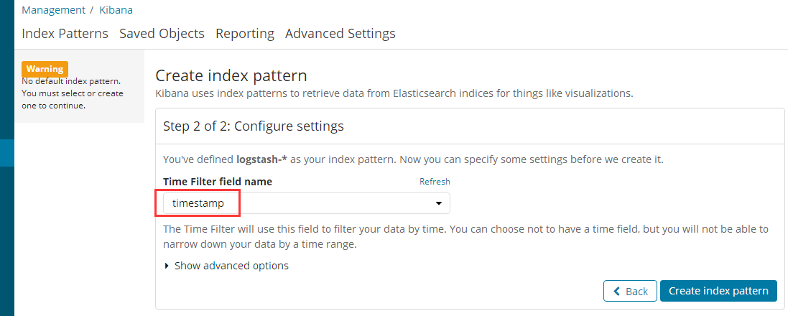

# Logging in Elasticsearch with Kibana

## 使用Docker部署Elasticsearch和Kibana

ELKstack是Elasticsearch、Logstash、Kibana三个开源软件的组合，是当今最为流行的统一日志分析平台。对于它们的介绍，网上非常之多，这里就不再多说。

在本文中只使用了`Elasticsearch`和`Kibana`，前者是分布式搜索系统，后者是一个可视化平台，使用docker来部署非常简单：

### 部署Elasticsearch

如下，绑定端口`9200`，并将容器命名为`elasticsearch`：

```bash
docker run --name=elasticsearch -d -p 9200:9200 -e "http.host=0.0.0.0" -e "transport.host=127.0.0.1" docker.elastic.co/elasticsearch/elasticsearch:6.2.2
```

然后在浏览器中打开 [http://localhost:9200/](http://localhost:9200/)，输出如下：

```json
{
	"name": "qFQvLqr",
	"cluster_name": "docker-cluster",
	"cluster_uuid": "bdc5YhZlQHu0mCN7acNKBw",
	"version": {
		"number": "6.2.2",
		"build_hash": "10b1edd",
		"build_date": "2018-02-16T21:01:30.685723Z",
		"build_snapshot": false,
		"lucene_version": "7.2.1",
		"minimum_wire_compatibility_version": "5.6.0",
		"minimum_index_compatibility_version": "5.0.0"
	},
	"tagline": "You Know, for Search"
}
```

### 部署Kibana

Kibana的部署依赖于Elasticsearch：

```bash
docker run --name=kibana --link=elasticsearch -d -p 5601:5601 docker.elastic.co/kibana/kibana:6.2.2
```

主要注意的是，在这里使用了`--link=elasticsearch`来链接到*elasticsearch*容器，如果要使用外部的elasticsearch服务，可以使用`-e "elasticsearch.url=http://changeme:9200"`来指定。

然后在浏览器中打开 [http://localhost:5601/](http://localhost:5601/)：


如上，部署成功，不过还没有任何数据。

### 使用docker-compose部署

当需要部署多个相关的服务时，更加推荐使用**docker-compose**来部署：

首先，我们创建一个`docker-compose.yml`文件：

```yml
version: '3'
services:
  elasticsearch:
    image: docker.elastic.co/elasticsearch/elasticsearch:${TAG}
    container_name: elasticsearch
    environment:
      - http.host=0.0.0.0
      - transport.host=127.0.0.1
      - ELASTICSEARCH_PASSWORD=${ELASTIC_PASSWORD}
    ports:
      - 9200:9200
    networks: 
      - stack

  kibana:
    image: docker.elastic.co/kibana/kibana:${TAG}
    container_name: kibana
    environment:
      - ELASTICSEARCH_USERNAME=kibana
      - ELASTICSEARCH_PASSWORD=${ELASTIC_PASSWORD}
    ports: 
      - 5601:5601
    networks: 
      - stack
    depends_on: 
      - elasticsearch

networks:
  stack:
    driver: bridge
```

如上，我们定义了`TAG`和`ELASTIC_PASSWORD`两个环境变量，方便在部署时候灵活的指定版本号和密码。

为方便测试部署，我们可以定义一个默认的环境变量文件`.env`：

```env
TAG=6.2.2
ELASTIC_PASSWORD=Qwer1234
```

然后，直接运行如下命令即可：

```bash
docker-compose up
```

接下来，将日志写入到Elasticsearch。

## 记录日志到Elasticsearch

我们创建一个 ASP.NET Core WebApi 项目，添加如下Package:

```bash
dotnet add package Zero.Logging.Elasticsearch --version 1.0.0-alpha3-20180228
```

### 添加ElasticsearchProvider

然后在`Program.cs`文件中使用`AddElasticsearch`扩展方法为日志系统添加`ElasticsearchProvider`：

```csharp
public static IWebHost BuildWebHost(string[] args) =>
    WebHost.CreateDefaultBuilder(args)
        .ConfigureLogging((hostingContext, logging) =>
        {
            logging.AddElasticsearch();
        })
        .UseStartup<Startup>()
        .Build();
```

### 记录日志

对于日志的记录则不需要任何的修改：

```csharp
public class ValuesController : Controller
{
    private readonly ILogger _logger;

    public ValuesController(ILogger<ValuesController> logger)
    {
        _logger = logger;
    }

    [HttpGet]
    public void Get()
    {
        _logger.LogTrace("Log Trace.");
        _logger.LogInformation("Log Information.");
        _logger.LogDebug("Log Debug.");
        try
        {
            throw new Exception("Boom");
        }
        catch (Exception ex)
        {
            _logger.LogCritical(1, ex, "Unexpected critical error starting application");
            _logger.LogError(1, ex, "Unexpected error");
            _logger.LogWarning(1, ex, "Unexpected warning");
        }
    }
}
```

### 在Kibana查看

刷新浏览器，显示如下：


在Index pattern中输入`logstash-*`，点击下一步：



如上，选择`timestamp`，创建索引，最终显示如下：


### 配置

如上一行代码，零配置完成Elasticsearch的写入，默认使用的Elasticsearch地址为`http://localhost:9200`，如果我们需要额外的配置也很简单，有如下两种方式：

#### 使用配置文件进行配置

在`appsettings.json`中添加如下配置：

```json
{
  "Logging": {
    "IncludeScopes": false,
    "Console": {
      "LogLevel": {
        "Default": "Warning"
      }
    },
    "Elasticsearch": {
      "LogLevel": {
        "Default": "Information"
      },
      "ElasticsearchUrl": "http://changeme:9200",
      "AutoRegisterTemplate": true
    }
  }
}
```

#### 使用代码进行配置

```csharp
WebHost.CreateDefaultBuilder(args)
    .ConfigureLogging((hostingContext, logging) =>
    {
        logging.AddFile().AddElasticsearch(o =>
        {
            o.PipelineName = "http://changeme:9200";
            o.AutoRegisterTemplate = true;
        });
    })
```

> 需要注意，如果使用代码的方式进行配置，则配置文件中的配置不再生效。

更多的配置信息参见 [EsLoggerOptions](https://github.com/RainingNight/zero-logging/blob/dev/src/Zero.Logging.Elasticsearch/EsLoggerOptions.cs)。